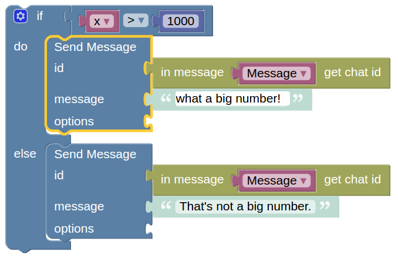
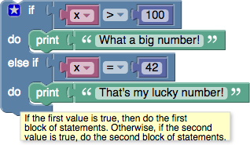
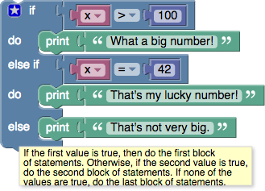
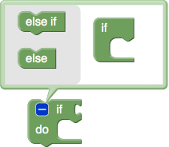

# شرط
شرط ها یکی از پایه ای ترین دستورات برنامه نویسی هستند. به کمک شرط ها می‌توانم دستوراتی مانند زیر را اجرا کنیم:

* اگر راهی به چپ هست، به چپ بچرخ.
* اگر امتیاز برابر ۱۰۰ است، به کاربر آفرین بگو.

# پازل های شرطی
## پازل if
ساده ترین عبارت شرطی، یک if تنها می‌باشد، مانند تصویر زیر:

هنگامی که اجرا شود مقدار متغییر x با عدد ۱۰۰ مقایسه خواهد شد. اگر بزرگتر باشد، "What a big number!" چاپ خواهد شد. در غیراینصورت اتفاقی نخواهد افتاد.

## پازل if-else
همچنین می‌توانیم طوری برنامه ریزی کنیم که در صورت درست نبودن عبارت شرطی نیز دستوراتی اجرا شوند.

مانند حالت قبل چنانچه مقدار x از صد بزرگتر باشد "What a big number!" چاپ خواهد شد. در غیراینصورت "That's not very big." چاپ خواهد شد.

یک عبارت **if** می‌تواند یک یا صفر **else** داشته باشد.

## پازل if-else-if
همچنین با یک عبارت میتوان بیش از یک شرط را بررسی کرد. برای این کار کافیست **else if** به عبارت اضافه کنیم.

چنانچه عدد بزرگتر از ۱۰۰ باشد "What a big number!" چاپ خواهد شد و در غیر اینصورت چنانچه x برابر ۴۲ باشد عبارت "That's my lucky number!" چاپ خواهد شد و در غیراینصورت اتفاقی نخواهد افتاد.

یک عبارت **if** می‌تواند هر تعدادی **else if** داشته باشد.

## پازل if-else-if-else
یک عبارت شرطی می‌تواند همزمان **else if** و **else** داشته باشد.

# ویرایش پازل
تنها یک پازل **if** در جعبه ابزار موجود می‌باشد.

برای افزودن عبارات **else if** و **else** باید بر روی چرخ دنده کلیک کنید تا پنجره جدیدی باز شود:

سپس برای اضافه کردن عبارات جدید می توانید پازل های **else if** و **else** را درون if قرار دهید. شما همچنین می توانید آنها را جا به جا کرده و یا حذف کنید.

دقت کنید شکل پازل ها اجازه می دهند هر تعدادی **else if** اضافه شود اما فقط یک **else**‌ می‌تواند اضافه شود.