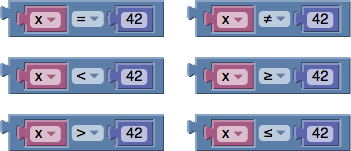

# منطق
جبر بولی یک سیستم ریاضی است که دو مقدار دارد :

* صحیح

* غلط

مقادیر بولی (نیز نامیده می شود شرایط ) در این بلوک کنترل، که شامل نمونه استفاده می شود:

* [بلوک های شرطی](http://puzlime.com/wiki/if.md)

* [بلوک های حلقه](http://puzlime.com/wiki/loops.md)

یک مثال ساده: 

اگر متغیر x بزرگتر از 1000 باشد، شرط صحیح می باشد و متن "What a big number!" فرستاده می شود. اگر متغیر x کوچکتر یا مساوی 1000 باشد، شرط غلط می باشد و متن "That's not a big number." فرستاده می شود.

## پازل 

زمانی که پازلی توقع یک متغیر بولی را دارد، معمولا ورودی غایب را **غلط** در نظر می گیرد.یک مثال پایین تر آمده است.متغیر های غیر بولی به پازل هایی که توقع متغیر بولی دارند، وصل نمی شود. 

## مقادیر

در یک پازل با منوی **صحیح** و **غلط** می توان برای مقادیر منطقی می توان استفاده کرد.

## پازل مقایسه

شش عملگر برای مقایسه وجود دارد. هر کدام جای دو ورودی را دارند و براساس ورودی ها و متغیر ها و عملگر، خروجی آن **صحیح** یا **غلط** می باشد.

6 عملگر شامل : تساوی ، نامساوی، بزرگتر، بزرگتر یا مساوی، کوچکتر، کوچکتر یا مساوی

## عملیات های منطقی

پازل **"و"** منطقی اگر هر دو ورودی آن صحیح باشند، صحیح بر می گرداند.

پازل **"یا"** منطقی اگر یکی از دو ورودی آن صحیح باشند، صحیح بر می گرداند.

## پازل not

پازل not ورودی منطقی خود را به نقیض آن تبدیل می کند. به عنوان مثال، خروجی تصویر زیر :

غلط می باشد.
